# Nori Ray Tracer (Ongoing)

Physically-based rendering engine with Monte Carlo sampling.

## Results

### Rendering

#### Surface Normal Visualization

| Ajax Bust (Octree) | Bunny (Surface Normal) |
|:------------------:|:----------------------:|
|  | 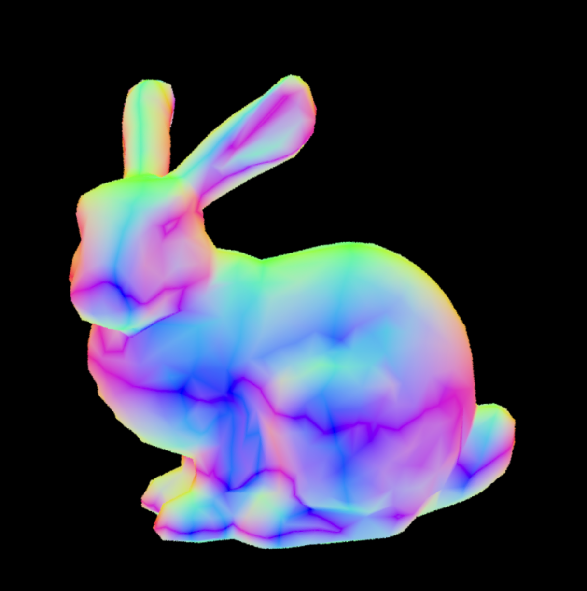 |

#### Simple Integrator

| With Shadow Ray | Without Shadow Ray |
|:---------------:|:------------------:|
| 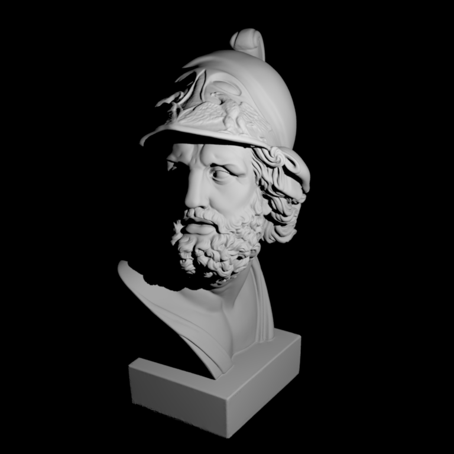 |  |

### Monte Carlo Sampling

<details open>
<summary><b>Sphere Sampling</b></summary>

| Distribution | PDF & χ² Test |
|:------------:|:-------------:|
|  |  |

</details>

<details open>
<summary><b>Hemisphere Sampling</b></summary>

| Distribution | PDF & χ² Test |
|:------------:|:-------------:|
|  | 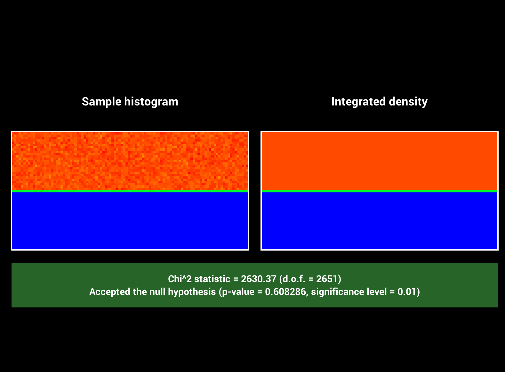 |

</details>

<details open>
<summary><b>Cosine-Weighted Hemisphere</b></summary>

| Distribution | PDF & χ² Test |
|:------------:|:-------------:|
| 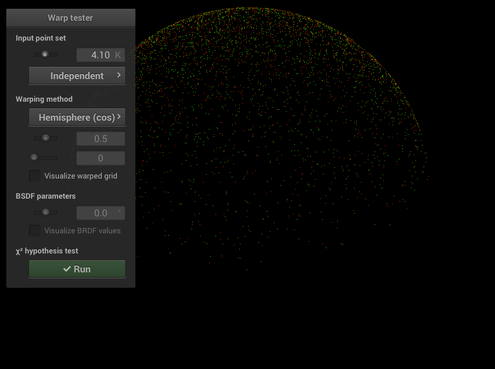 | 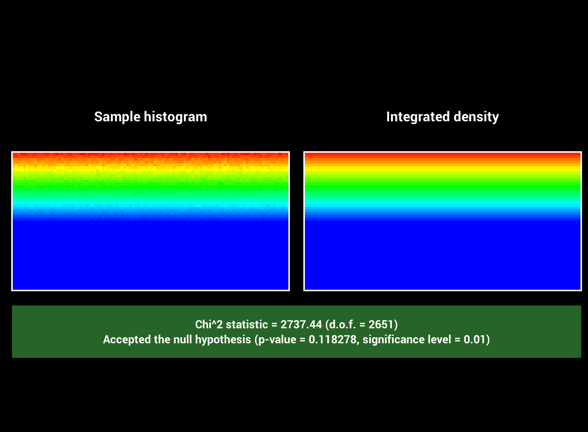 |

</details>

<details open>
<summary><b>Beckmann Distribution</b></summary>

| Distribution | PDF & χ² Test |
|:------------:|:-------------:|
| 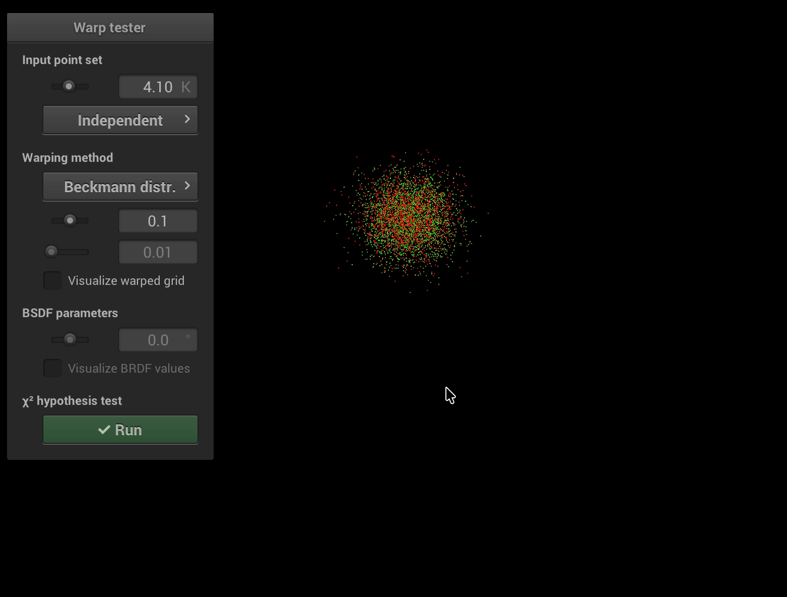 | 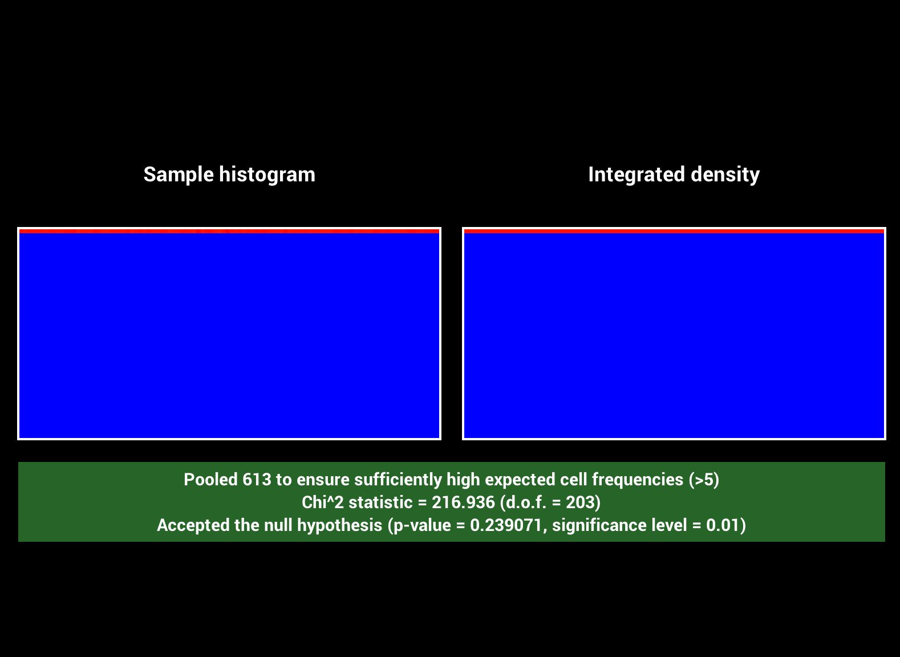 |

</details>

<details open>
<summary><b>Tent Distribution</b></summary>

| Distribution | PDF & χ² Test |
|:------------:|:-------------:|
| 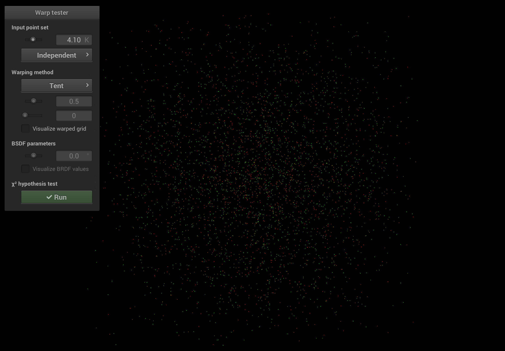 | 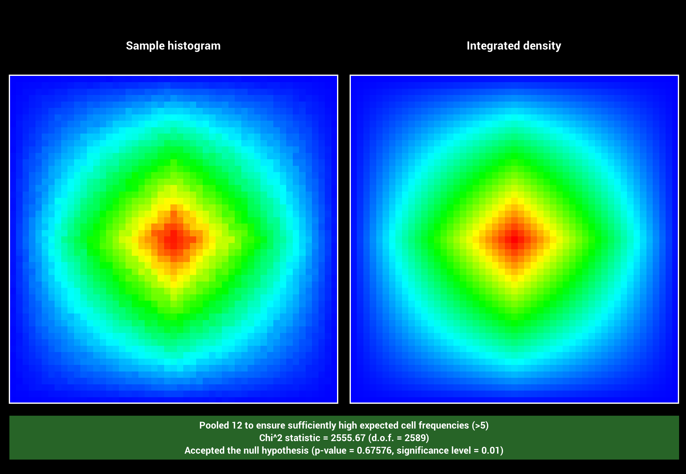 |

</details>

<details open>
<summary><b>Uniform Disk</b></summary>

| Distribution | PDF & χ² Test |
|:------------:|:-------------:|
| 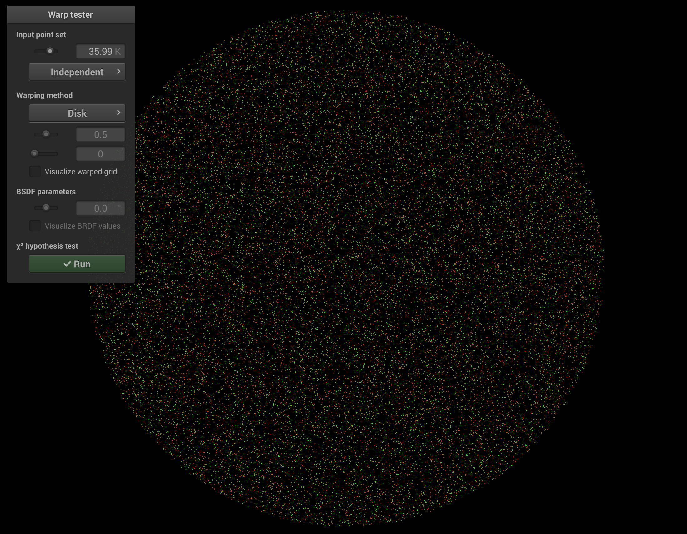 | 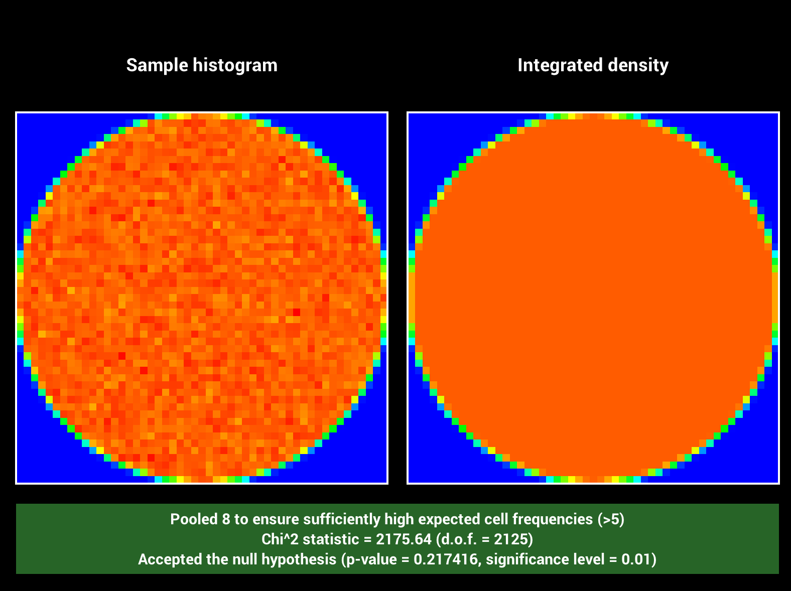 |

</details>

## Features

- Ray tracing with Octree acceleration
- Monte Carlo sampling (Tent, Disk, Sphere, Hemisphere, Cosine-weighted, Beckmann)
- Chi-squared statistical validation
- Surface normal visualization

## Build

### TBB Configuration Fix

**CMakeLists.txt**: Move `find_package(TBB)` to root (lines 5-8)

**ext/CMakeLists.txt**: Remove duplicate `find_package` (lines 131-134, 184)

**src/main.cpp**:
```cpp
// Line 30
#include <tbb/global_control.h>

// Line 91
tbb::global_control

// Line 244
std::thread::hardware_concurrency()
```

### Build Commands

```bash
mkdir build && cd build
cmake ..
make -j
```

## Run

```bash
./nori scene.xml
./warptest
```

---

Advanced Computer Graphics Project
